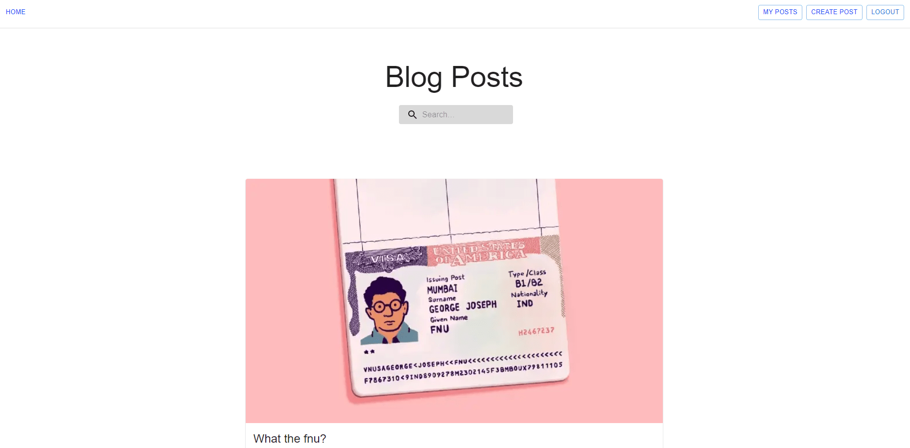
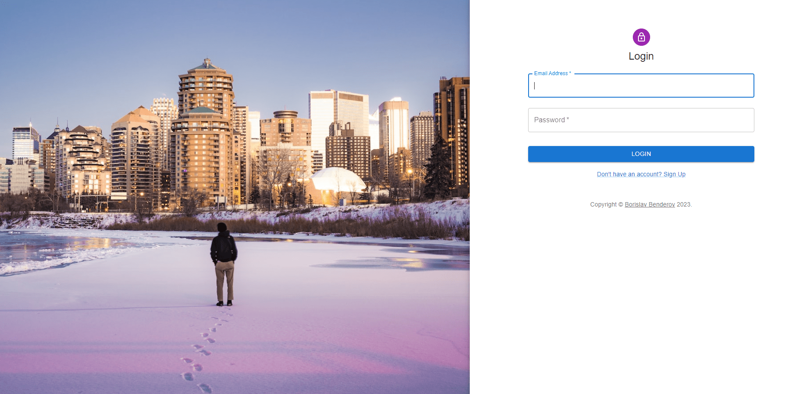
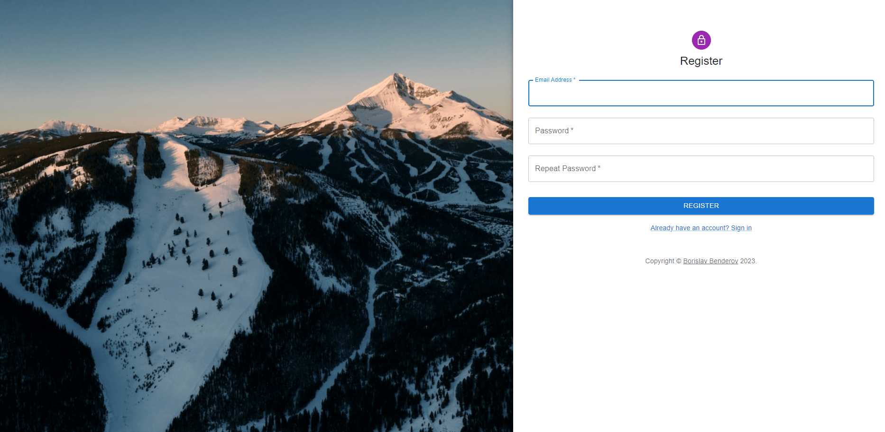
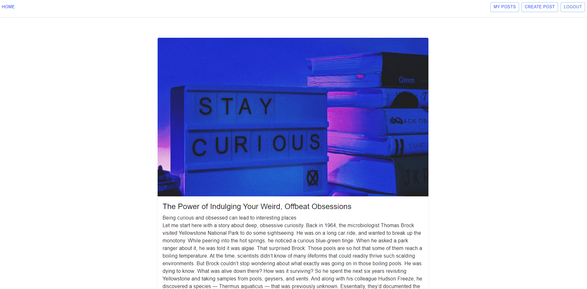
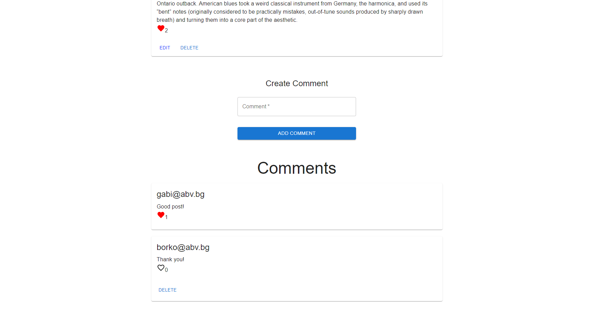
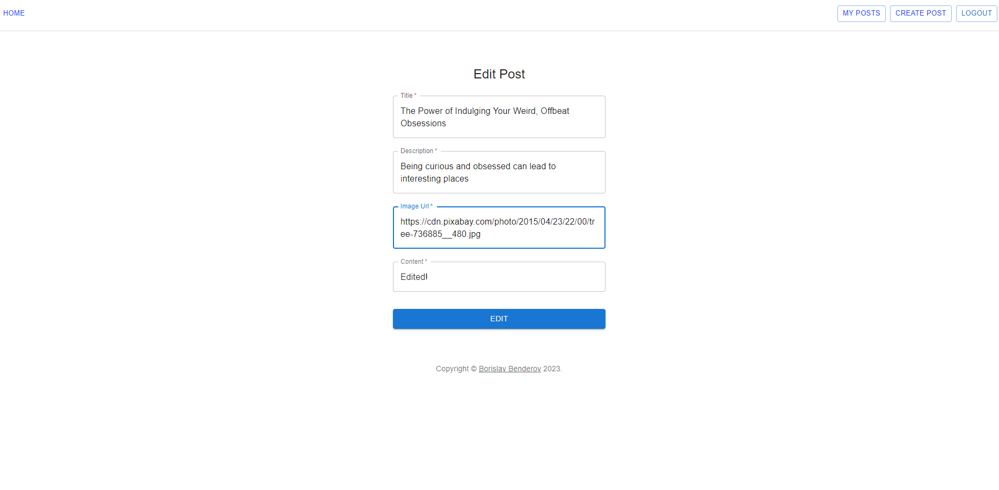
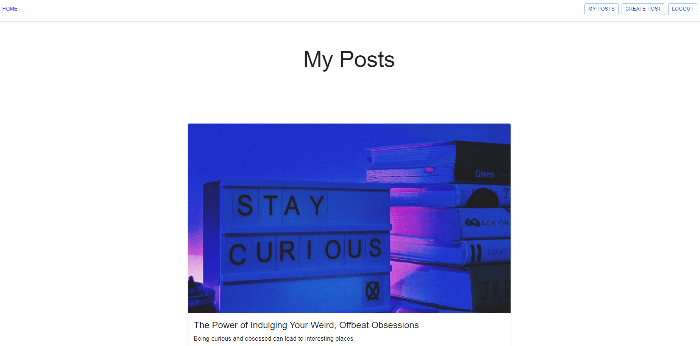
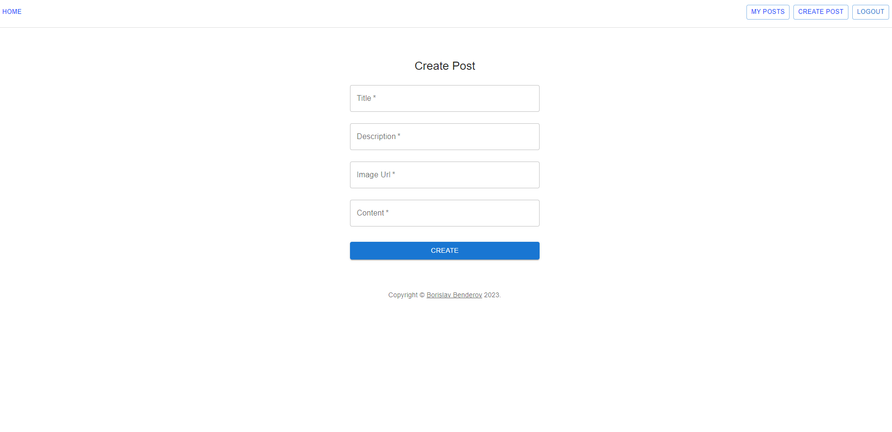

# Blog Application with React JS, Typescript and Material UI

## Project Description

Blog application created with React JS, Typescript and Material UI. Users can interact with each other with comments on different posts. They can create, edit, like and delete posts. Users have possibility to make comments on different posts, like comments and delete their comments.

## Services

### Login

This service is initialized with two users, which can be used for immediate testing:

- borko@abv.bg: 123456
- gabi@abv.bg: 123456

### Register

Create a new user by entered email, password and confirmation password.

### Home

After login or register user will be redirect to a home page. On this page user can see all users posts with their titles and descriptions.

### Post Details

When user click on read button on some post he will see current post with his title, image, description and content.

### Comments and Likes

After the end of post content user will see comment section with add comment container and like button with number of likes. User can like post and make a comment. If user is owner of the post he will see edit and delete buttons.

### Edit Post

When user click on edit button on some of his posts he can possibility to edit current post title, description, image url and content.

### Delete

When user click on delete button on some of his posts user will be asked to delete this post. If he confirm post will be deleted.

### User Posts

When user click on my posts button in navigation panel he will see all of his posts (if any).

### Create Post

When user click on create post button in navigation panel he will see create post page. On this page user can create a post with title, description, image url and content.

### Search

In home page user have possibility to search posts by their title or description.

### Logout

When user click on logout button in navigation panel his session has expired.

### Guest Users

Guest users have possibility to see all blog posts and comments but they can't to change anything.

### Live Demo

https://borislavbenderov.github.io/blog-ts-app